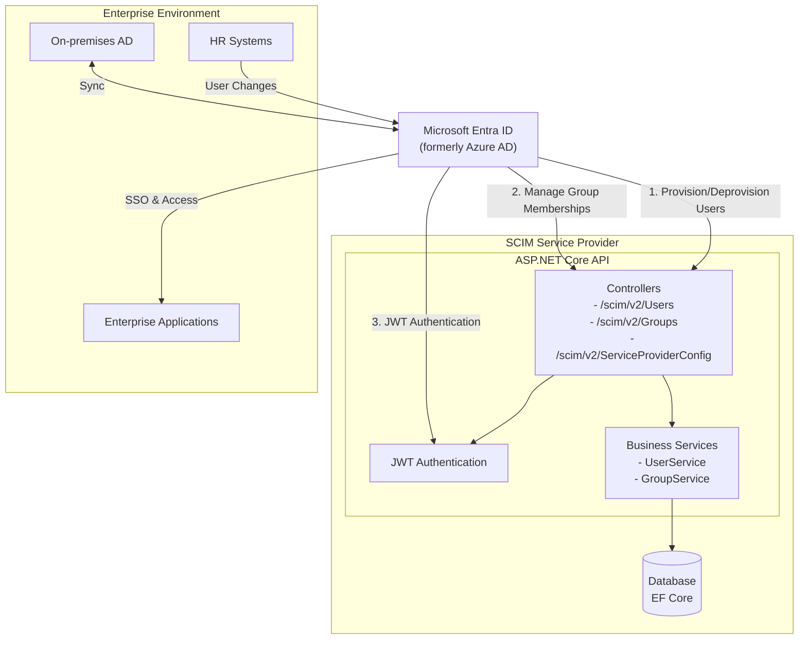

# SCIM Service Provider Architecture Diagram

The following diagram illustrates how this SCIM service provider integrates with Microsoft Entra ID (formerly Azure AD) for automated user provisioning.

## Architecture Overview

## Integration Flow

### Microsoft Entra ID (Azure AD) Integration
1. **Setup**: Enterprise application registered in Entra ID and configured for SCIM provisioning
2. **Authentication**: Secure connection established using JWT bearer token
3. **Provisioning**: 
   - Users created in Entra ID are automatically provisioned to the SCIM provider
   - User attribute updates are synchronized
   - User deactivation/deletion is reflected
   - Group assignments are managed
4. **Automated Sync**: Changes in HR systems or on-premises AD propagate through Entra ID to the SCIM provider

## Key Components

### SCIM Service Provider
- **Controllers**: Handle SCIM 2.0 protocol requests (Users, Groups, ServiceProviderConfig)
- **Authentication**: JWT token validation for secure access
- **Services**: Business logic for user and group management
- **Database**: Storage for user and group data (configurable for in-memory or SQL Server)

### Entra ID Features
- **User Lifecycle Management**: Automatic creation, updates, and deactivation
- **Group Management**: Assignment and removal of users to/from groups
- **Just-in-time Provisioning**: Users created on first access
- **Attribute Mapping**: Configure which attributes synchronize between systems
