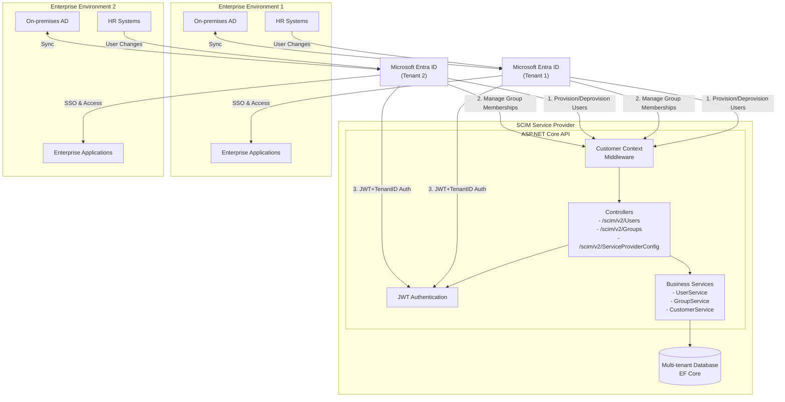

# SCIM Service Provider Architecture Diagram

The following diagram illustrates how this SCIM service provider integrates with Microsoft Entra ID (formerly Azure AD) for automated user provisioning in a multi-tenant environment.

## Architecture Overview

## Multi-Tenant Architecture

### Tenant Isolation
1. **Data Separation**: Each tenant's data (users and groups) is logically isolated using tenant identifiers
2. **Request Processing**: 
   - Tenant context middleware extracts tenant ID from requests (headers or JWT claims)
   - Controllers and services apply tenant filtering to all operations
3. **Security**: Cross-tenant data access is prevented at multiple layers

### Data Model
- **Customer**: Represents a tenant with unique TenantId and configuration
- **Resources**: Users and Groups are associated with exactly one Customer
- **Relationships**: Navigation properties enable efficient querying while maintaining isolation

## Integration Flow

### Microsoft Entra ID (Azure AD) Integration
1. **Setup**: Enterprise application registered in Entra ID and configured for SCIM provisioning with tenant context
2. **Authentication**: Secure connection established using JWT bearer token containing tenant identifier
3. **Provisioning**: 
   - Users created in Entra ID are automatically provisioned to the correct tenant in the SCIM provider
   - User attribute updates are synchronized within tenant boundaries
   - User deactivation/deletion is reflected in the appropriate tenant
   - Group assignments are managed within tenant context
4. **Automated Sync**: Changes in HR systems or on-premises AD propagate through Entra ID to the specific tenant in the SCIM provider

## Key Components

### SCIM Service Provider
- **Controllers**: Handle SCIM 2.0 protocol requests (Users, Groups, ServiceProviderConfig) with tenant context
- **Customer Context Middleware**: Extracts and validates tenant information from requests
- **Authentication**: JWT token validation with tenant identification for secure access
- **Services**: Tenant-aware business logic for user, group, and customer management
- **Database**: Multi-tenant storage for user and group data with tenant isolation (configurable for in-memory or SQL Server)

### Entra ID Features
- **User Lifecycle Management**: Automatic creation, updates, and deactivation
- **Group Management**: Assignment and removal of users to/from groups
- **Just-in-time Provisioning**: Users created on first access
- **Attribute Mapping**: Configure which attributes synchronize between systems

## Multi-Tenant Implementation Details

### Middleware Layer
The Customer Context Middleware inspects each incoming request to SCIM endpoints and handles tenant identification:

- Extracts tenant identifiers from request headers (`X-Tenant-ID`) or JWT claims (`tenant_id`)
- Validates tenant existence and active status using the Customer Service
- Sets tenant context in `HttpContext.Items` for downstream components
- Returns appropriate HTTP status codes for missing or invalid tenant information

### Service Layer
Services implement tenant isolation through filtering:

- All service methods accept a `customerId` parameter
- Database queries include tenant filters in all CRUD operations
- Navigation properties are used for efficient related data retrieval
- Cross-tenant operations are prevented at the service level

### Controller Layer
Controllers consume tenant context set by the middleware:

- Extract `CustomerId` from `HttpContext.Items`
- Pass tenant context to all service method calls
- Maintain compliance with SCIM 2.0 protocol while ensuring tenant isolation

### Data Model
The data model supports multi-tenancy through relationships:

- `Customer` entity represents a tenant with configuration data
- `ScimUser` and `ScimGroup` entities include required `CustomerId` foreign key
- Navigation properties establish relationships between entities
- Entity Framework queries leverage these relationships for efficient data access

This multi-tenant architecture allows the SCIM Service Provider to serve multiple organizations from a single deployment while maintaining strict data isolation between tenants.
