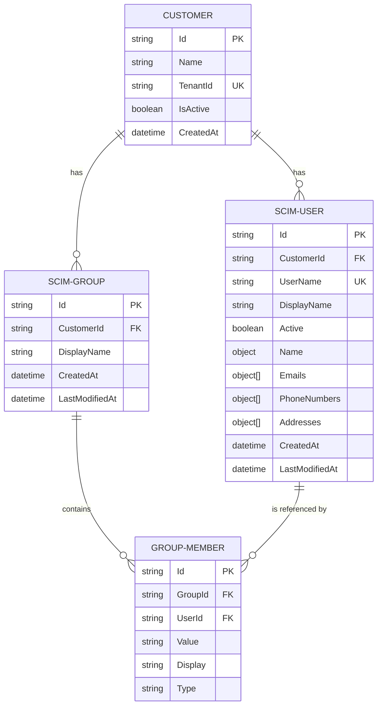

# SCIM Service Provider Data Model

The entity relationship diagram below shows the multi-tenant data model for the SCIM Service Provider:

## Entity Descriptions

### CUSTOMER
The CUSTOMER entity represents a tenant in the multi-tenant architecture. Each customer has their own isolated set of users and groups.

### SCIM-USER
The SCIM-USER entity represents a user in the SCIM system, always belonging to exactly one customer. The user data follows the SCIM 2.0 User schema.

### SCIM-GROUP
The SCIM-GROUP entity represents a group in the SCIM system, always belonging to exactly one customer. Groups contain members and follow the SCIM 2.0 Group schema.

### GROUP-MEMBER
The GROUP-MEMBER entity represents the membership of users in groups. It establishes a many-to-many relationship between users and groups.

## Key Relationships

1. **Customer to Users**: One-to-many relationship. A customer can have multiple users, but each user belongs to exactly one customer.

2. **Customer to Groups**: One-to-many relationship. A customer can have multiple groups, but each group belongs to exactly one customer.

3. **Group to Members**: One-to-many relationship via the GROUP-MEMBER entity. A group can have multiple members.

4. **User to Group Memberships**: One-to-many relationship via the GROUP-MEMBER entity. A user can be a member of multiple groups.

## Data Isolation

This model ensures complete data isolation between tenants by:

1. Associating every user and group with exactly one customer through the CustomerId foreign key
2. Filtering all queries by CustomerId in the service layer
3. Ensuring no cross-tenant data access can occur

The CustomerId field serves as both a technical key for database relationships and as a security boundary for tenant isolation.
