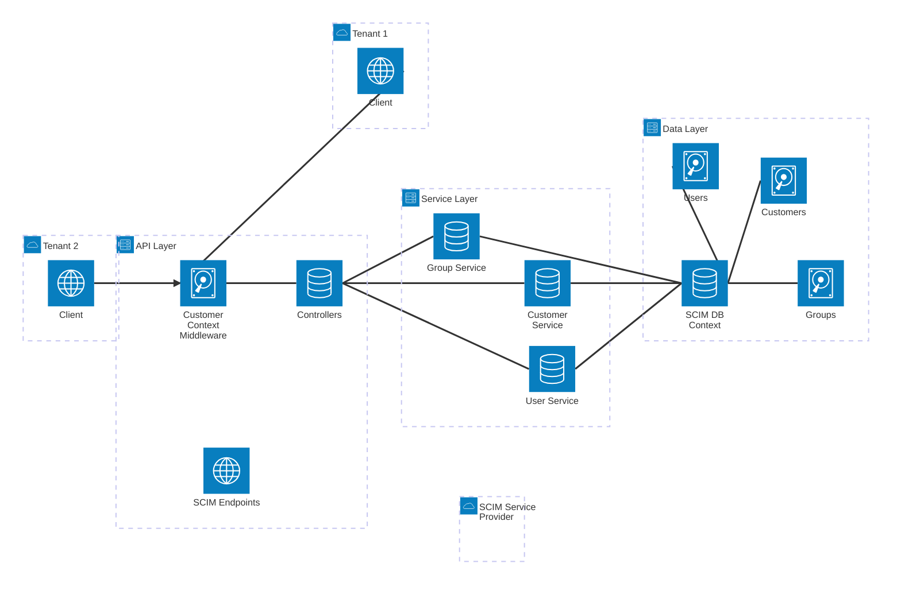

# Multi-Tenant Architecture Diagram

The following architecture diagram illustrates the multi-tenant design of the SCIM Service Provider:

## Key Components

1. **Client Tenants**: Separate clients representing different organizations or tenants that connect to the SCIM Service.

2. **Customer Context Middleware**: Intercepts all requests, extracts tenant information, and establishes tenant context.

3. **Controllers**: Use tenant context to ensure operations are tenant-specific.

4. **Service Layer**: Implements tenant-aware business logic with customerId parameters.

5. **Data Layer**: Enforces data isolation between tenants at the database level.

## Data Flow

1. Clients from different tenants send requests to the SCIM endpoints.
2. Customer Context Middleware identifies the tenant from headers or JWT claims.
3. Controllers retrieve tenant context and pass it to service methods.
4. Services filter data operations by tenant ID.
5. Database queries include tenant filters, ensuring data isolation.

This architecture ensures that each tenant's data remains completely isolated while maintaining a single deployment of the application.
